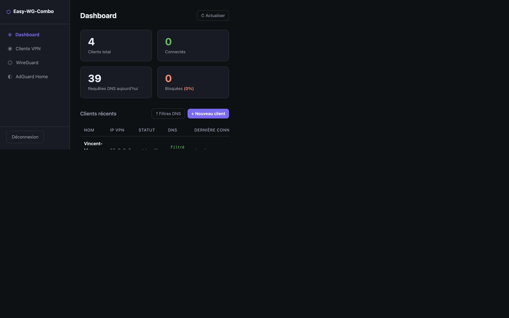
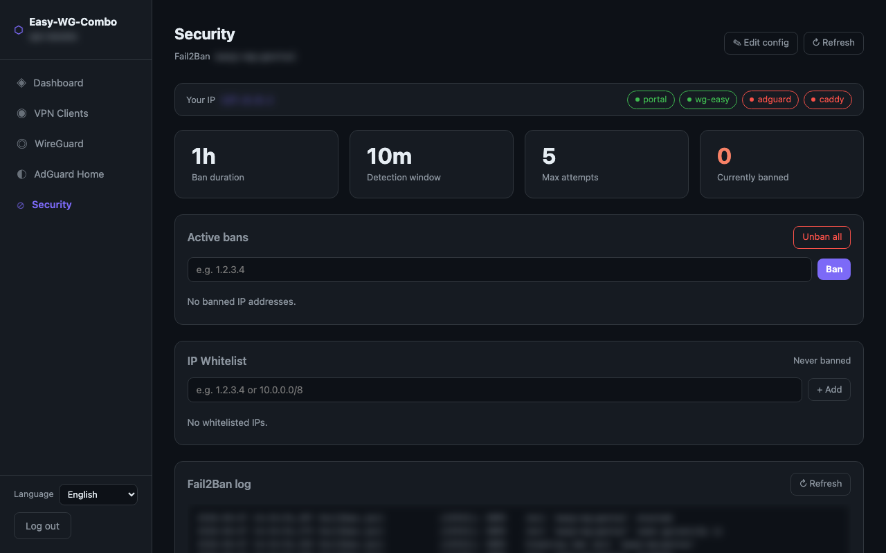
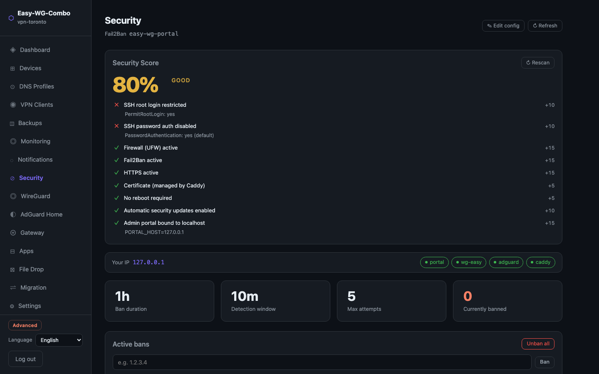
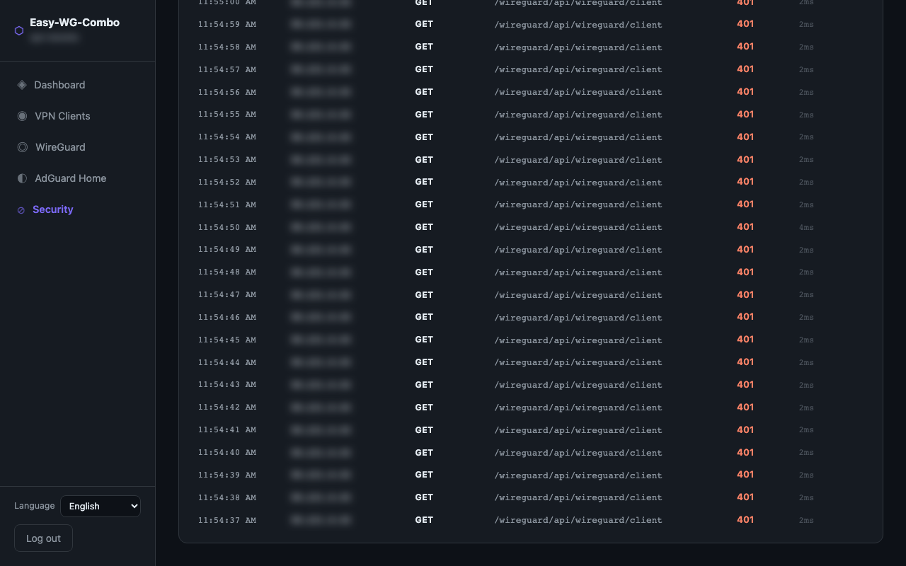
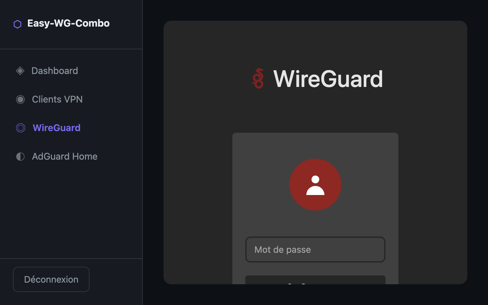
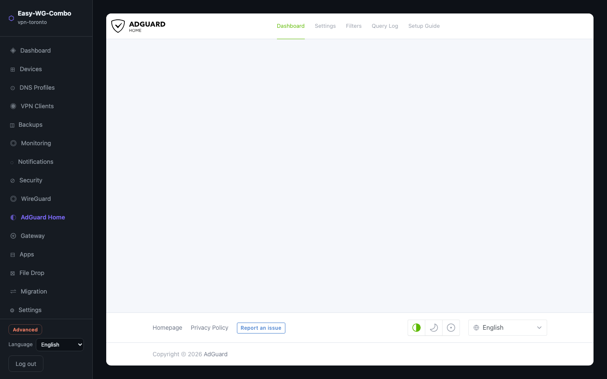

# Easy-WG-Combo

Self-hosted VPN stack: WireGuard + AdGuard Home + custom admin portal.

## Stack

| Container | Role | Port (internal) |
|---|---|---|
| `wg-easy` v14 | WireGuard peer management | `127.0.0.1:51821` |
| `adguard` | DNS filtering (ads + malware) | `0.0.0.0:3000`, `0.0.0.0:53` |
| `portal` | Unified admin UI + API | `0.0.0.0:8080` |

All admin UIs are localhost-only. Access via SSH tunnel.

## Features

### Core VPN & DNS
- **Dashboard** — connected clients, AdGuard stats (queries, blocked rate), Fail2Ban status
- **VPN Clients** — create/delete clients with DNS preset choice and QR code displayed immediately
- **Change DNS filter** — instant per-client filter change via AdGuard API (no reconnection needed)
- **DNS presets** — Filtered / Malware-only / No filter, with help modal
- **Auto DNS discovery** — existing clients' DNS presets detected on first load
- **WireGuard & AdGuard UIs** — embedded as iframes for advanced config
- **Multilingual portal UI** — language switcher with full interface coverage in **English, French, and Chinese**
- **Server name support** — prompted during deployment, shown in the dashboard, editable later from the UI, and embedded in generated `.conf` filenames
- **Auto HTTPS admin access** — Caddy reverse proxy with automatic certificate management (domain) or internal TLS fallback (IP)
- **Security tab** — full Fail2Ban management: ban/unban IPs, IP whitelist, live config edit, jail log viewer, active session management, TLS certificate info, access log viewer with filters, service health status, password change

### Phase 2 — Devices, DNS Profiles & Gateway
- **Device inventory** — per-device metadata, expiry dates, routing mode, enable/disable/revoke
- **DNS profiles** — Filtered / Malware-only / No filter / Custom, per-device assignment, timed bypass
- **Routing wizard** — Full-tunnel, Split-tunnel, Bypass modes per device
- **Reverse proxy / Gateway** — manage Caddy services (domain → target) from the UI; VPN-only or public exposure

### Phase 3 — Monitoring, Apps, File Drop & Migration
- **Uptime Monitor** — http/https/tcp/dns/docker/tls/wireguard checks, 60 s background scheduler, alert notifications, history per monitor, auto-seeded defaults on first run
- **App Launcher** — install and manage 5 curated self-hosted apps (Uptime Kuma, ntfy, FileBrowser, Stirling PDF, Vaultwarden) via Docker Engine API; auto proxy + monitor creation on install
- **Secure File Drop** — drag-and-drop upload with expiry, download limit, optional password (PBKDF2), public or VPN-only mode; token-gated public download link (no auth required)
- **Migration Assistant** — service readiness check, DNS plan from live proxy config, WireGuard client impact analysis, numbered checklist with live VPS values, one-click migration backup export

## Screenshots

### Dashboard



### VPN Clients


### Security tab







### Integrated WireGuard view



### Integrated AdGuard Home view



## Quick start

### Recommended VPS

If you want to spin up a VPN server quickly, a Vultr VPS is a good fit for this project. The link below is part of a referral program, so it may also help you earn credits depending on Vultr's terms:

https://www.vultr.com/?ref=8489819

Example configuration to use in the docs or for a new deployment: the basic Vultr plan at $5/month, located in Toronto, with 1 vCPU, 1 GB of RAM, 25 GB SSD, and about 4.22 GB of bandwidth used over the reference period. For the OS, use Debian 12 or Ubuntu 24.04 LTS.

Example baseline server sizing:

- vCPU/s: 1 vCPU
- RAM: 1024 MB
- Storage: 25 GB SSD
- OS: Debian 12 or Ubuntu 24.04 LTS

### First-time VPS bootstrap

From a fresh Debian/Ubuntu VPS, you can run everything with a single download-and-execute command:

```bash
export WG_HOST=YOUR_VPS_IP SERVER_NAME=vpn_toronto ADMIN_PASSWORD='yourpassword' SSH_PORT=22
curl -fsSL https://raw.githubusercontent.com/r45635/Easy-WG-Combo/refs/heads/main/install.sh | bash
```

If you prefer interactive prompts, download then run the script locally on the VPS:

```bash
curl -fsSLO https://raw.githubusercontent.com/r45635/Easy-WG-Combo/refs/heads/main/install.sh
chmod +x install.sh
./install.sh
```

Interactive installer UX (user-friendly defaults):
- Prompts for installation path (default: `~/Easy-WG-Combo`).
- Detects an existing installation in that path.
- Offers explicit actions:
  - `upgrade` (default): update and continue in the same path
  - `new`: pick another path for a fresh install
  - `remove`: complete removal of the installation and containers, then exit

If you already cloned the repository on the VPS, you can run the bootstrap directly:

```bash
sudo ./bootstrap.sh
```

### Validated interactive bootstrap flow (default path)

The default interactive path was validated on a real VPS. Prompt order and defaults:

1. `Run Docker prune cleanup before deployment? [Y/n]`
  - Default (Enter): `Yes`
2. Existing install detected, then `Action (k/n):`
  - `k` = keep existing configuration and just start/restart containers
  - `n` = create a backup first, then initialize a new configuration
3. `Server name [current-or-hostname]:`
  - Default (Enter): keep the current saved name, or use sanitized hostname on first install
4. `WireGuard public UDP port [51820]:`
  - Default (Enter): `51820`

In the validated default run: prune ran, `k` (keep) was selected, default server name was accepted, and all 3 containers started.

When existing containers/data are detected, the bootstrap now asks what to do:
- `keep` — keep existing configuration and just start/restart the stack
- `new` — start a new configuration (a backup is created first)

The bootstrap also asks for a short server name.
- Default on a fresh install: the VPS hostname
- Default on an existing install: the current saved server name
- Allowed characters: letters, numbers, `-` and `_` only

For non-interactive runs, set the action explicitly:

```bash
export EXISTING_CONFIG_ACTION=new
curl -fsSL https://raw.githubusercontent.com/r45635/Easy-WG-Combo/refs/heads/main/install.sh | bash
```

Non-interactive notes:
- If an existing configuration is detected, `EXISTING_CONFIG_ACTION` is required (`keep` or `new`).
- Optional override variables: `SERVER_NAME`, `PRUNE_BEFORE_DEPLOY`, `MIN_FREE_MB`, `BACKUP_DIR`.

Public admin HTTPS defaults:
- Enabled by default with `PUBLIC_HTTPS_ENABLED=yes`
- Uses `ADMIN_DOMAIN` (recommended) or `WG_HOST` fallback
- `TLS_EMAIL` is optional and used for ACME registration on public domain certificates
- Opens `80/tcp` and `443/tcp` in UFW when HTTPS public mode is enabled

Fail2Ban defaults:
- Installed and configured automatically by bootstrap
- Jail name: `easy-wg-portal` (override with `FAIL2BAN_JAIL`)
- Default thresholds: `FAIL2BAN_MAXRETRY=5`, `FAIL2BAN_FINDTIME=10m`, `FAIL2BAN_BANTIME=1h`
- Login failures on `/api/login` are monitored from Caddy access logs

Backups are written to `./backups/<timestamp>` inside the project directory by default.
You can override the destination with `BACKUP_DIR=/your/path`.

Before deployment, the bootstrap now verifies free disk space and can run a Docker prune cleanup.
- Interactive mode: asks `Run Docker prune cleanup before deployment? [Y/n]` (default: Yes)
- Non-interactive mode: controlled by `PRUNE_BEFORE_DEPLOY` (default: `yes`)
- Minimum free space threshold: `MIN_FREE_MB` (default: `2048`)

The script will install Docker, Docker Compose, UFW, and the small host dependencies this stack needs, then it will create `.env` and `.env.secrets`, generate the `wg-easy` password hash, apply the host forwarding/firewall settings, and start the stack.

If you want to override the defaults non-interactively, you can pass the values inline:

```bash
sudo WG_HOST=YOUR_VPS_IP ADMIN_PASSWORD='yourpassword' SSH_PORT=22 ./bootstrap.sh
```

### Portal server name behavior

- Displayed in the login subtitle, sidebar title block, and dashboard heading.
- Editable from the dashboard using the rename server action.
- Validation allows letters, numbers, `-`, and `_` only.
- Downloaded WireGuard files include the server name:
  - `wireguard-<server-name>-<client-name>.conf`

### Dashboard Fail2Ban section

- Shows jail name, currently banned IP count, and total bans.
- Lists currently banned IPs.
- Supports one-click unban from the portal UI.

### Security tab

Full Fail2Ban management and server security overview accessible from the **Security** sidebar item:

| Section | Description |
|---|---|
| **Status bar** | Your current IP (as seen by the server) · Health badges for portal / wg-easy / adguard / caddy |
| **Fail2Ban stats** | Ban duration · Detection window · Max attempts · Currently banned count |
| **Edit config** | Live Fail2Ban parameter edit (bantime, findtime, maxretry) without restarting |
| **Active bans** | List of banned IPs with per-IP unban · Manual ban input · Unban all |
| **IP Whitelist** | Add/remove IPs or CIDR ranges from `ignoreip` — these are never auto-banned |
| **Fail2Ban log** | Last 100 entries from `/var/log/fail2ban.log` filtered to the active jail |
| **Active sessions** | All open portal sessions (IP, user-agent, login time) — revoke any session individually |
| **TLS Certificate** | Domain, issuer, type (internal / ACME), expiry date with days-left indicator |
| **Change password** | Change the portal admin password — persisted immediately without restart |
| **Access log** | Last 200 Caddy access log entries — filter by All / Errors (4xx/5xx) / 401 only · Auto-refresh toggle |

### Manual setup

```bash
# 1. Clone
git clone https://github.com/r45635/Easy-WG-Combo.git
cd Easy-WG-Combo

# 2. Configure
cp .env.example .env
# Edit .env: set WG_HOST, ADMIN_PASSWORD, ports

# 3. Set wg-easy password hash (bcrypt — $ signs break docker-compose interpolation)
docker run --rm ghcr.io/wg-easy/wg-easy:14 wgpw 'yourpassword'
# Copy the output into .env.secrets:
echo "export PASSWORD_HASH='<paste hash here>'" > .env.secrets

# 4. Start
./compose.sh up -d
```

> **Always use `./compose.sh`**, not `docker compose` directly.
> `compose.sh` sources `.env.secrets` which sets `PASSWORD_HASH` in the shell environment,
> bypassing docker-compose's variable interpolation that would mangle the bcrypt hash.

## CLI (`easywg`) — v3.0.0

All portal features are available from the terminal via `./easywg <command>`.

```
./easywg status                    # System health summary
./easywg backup                    # Create a configuration backup
./easywg restore <file>            # Restore from backup

./easywg device list               # List WireGuard devices
./easywg dns profiles              # List DNS profiles
./easywg route set <id> <mode>     # Set routing mode for a device
./easywg proxy list                # List reverse proxy services

./easywg monitor list              # List uptime monitors
./easywg monitor check <id>        # Run a check immediately
./easywg monitor add               # Add a new monitor (interactive)

./easywg app catalog               # List installable apps
./easywg app list                  # List installed apps
./easywg app install <id>          # Install an app
./easywg app logs <id>             # Show container logs

./easywg filedrop list             # List active file shares
./easywg filedrop upload <file>    # Upload a file, get share link
./easywg filedrop status           # Show storage usage
./easywg filedrop cleanup          # Remove expired shares
```

## Admin access (SSH tunnel)

Recommend using non-standard local ports to avoid conflicts with local dev tools:

```bash
ssh -i ~/.ssh/your_key \
  -L 19080:localhost:8080 \
  -L 19821:localhost:51821 \
  -L 19300:localhost:3000 \
  -N root@YOUR_VPS_IP
```

Then open: `http://localhost:19080`

## DNS filter presets

| Preset | Behavior | DNS used |
|---|---|---|
| Filtered | Blocks ads + malware via AdGuard lists | `10.8.0.1` → AdGuard global |
| Malware only | Malware blocked, ads allowed | `10.8.0.1` → upstream `1.1.1.2` |
| No filter | Nothing blocked, direct DNS | `10.8.0.1` → upstream `1.1.1.1` |

**Changing filter for a connected client:** click ⚙ in the client table — takes effect immediately via AdGuard per-client settings API. Persistent across reconnections.

## Architecture notes

- `PASSWORD_HASH` in `.env.secrets` (gitignored) — bcrypt `$` signs are mangled by docker-compose variable interpolation whether in `environment:`, `env_file:`, or `.env`. Shell env pass-through (`- PASSWORD_HASH` without value) is the only reliable method.
- `adguard` and `portal` use `network_mode: host` to share the host network stack (required for DNS on port 53 and WireGuard interface access).
- `wg-easy` pinned to `v14` — v1.0.x has an incompatible API rewrite.
- DNS auto-discovery: on first `/api/clients` call, portal fetches WireGuard configs for unknown clients and extracts their DNS line.

## Firewall (UFW)

Public ports:
- `22/tcp` — SSH
- `51820/udp` — WireGuard VPN

Port 53 open on `wg0` interface only (WireGuard clients).
All admin ports (8080, 51821, 3000) bound to localhost.
