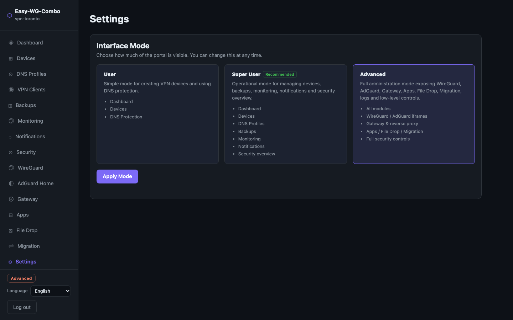

# Easy-WG-Combo

Easy-WG-Combo turns a small VPS into a personal VPN, DNS protection, security and monitoring appliance.

It combines WireGuard, AdGuard Home, a custom admin portal, HTTPS access, security checks, backups, notifications and optional advanced gateway features — without requiring users to manually assemble and maintain many separate tools.

---

## What It Does

- **WireGuard VPN** — create and manage devices, generate QR codes, share configs
- **VLESS+Reality** — optional DPI-resistant tunnel (Xray); per-device QR codes; for censored networks
- **AdGuard Home DNS** — block ads and malware per device; switch presets without reconnecting
- **Security Center** — Fail2Ban monitoring, UFW status, TLS certificate, session management, security score
- **Backups** — local backup and restore with a guided workflow
- **Monitoring** — HTTP, HTTPS, TCP, DNS, Docker, TLS and service checks with alerts
- **Notifications** — email and webhook alerts for monitor events
- **Mobile-friendly** — responsive UI with hamburger sidebar for smartphone access
- **Multilingual** — English, French, Chinese

Optional advanced features: reverse proxy/gateway, app launcher, secure file drop, migration assistant.

---

## Who It Is For

Easy-WG-Combo is designed for:
- Personal VPS users who want a VPN without manual WireGuard configuration
- Homelab users managing a small set of devices
- Families who want simple DNS-based ad and malware blocking
- Small teams needing basic private remote access

It is not intended to replace enterprise VPN gateways, zero-trust platforms or managed security appliances.

---

## Feature Status

| Feature | Status | Notes |
|---|---|---|
| WireGuard device management | Stable | Devices, QR codes, configs |
| AdGuard DNS filtering | Stable | Per-device presets |
| Mobile-responsive UI | Stable | Hamburger menu, collapsible sidebar |
| Security Center | Beta | Fail2Ban, UFW, sessions, TLS, security score |
| Backup / Restore | Beta | Local backup and guided restore |
| Notifications | Beta | SMTP and webhook |
| Device Inventory | Beta | User-friendly device management |
| DNS Profiles | Beta | Per-device DNS profiles with timed bypass |
| Monitoring | Beta | HTTP, TCP, DNS, Docker, TLS checks |
| VLESS+Reality (Xray) | Beta | DPI-resistant tunnel; per-device UUIDs; QR from Devices tab |
| Gateway / Reverse Proxy | Experimental | VPN-only and public HTTPS exposure |
| Apps | Preview | Catalog visible; install/manage not production-ready |
| File Drop | Preview | UI available; not recommended for sensitive use yet |
| Migration Assistant | Preview | Checklist/helper only |

→ [Detailed feature status](docs/feature-status.md)

---

## Interface Modes

The portal has three modes so users are not exposed to unnecessary complexity. Switch from the **Settings** tab at any time.

| Mode | Intended user | Visible features |
|---|---|---|
| **User** | Basic VPN user | Devices, QR codes, simple DNS protection |
| **Super User** *(default)* | Appliance operator | Devices (incl. VLESS QR), DNS profiles, backups, monitoring, notifications, security overview |
| **Advanced** | Full administrator | WireGuard, AdGuard, Gateway, Apps, File Drop, Migration, logs and advanced security controls |

→ [Interface modes reference](docs/interface-modes.md)

---

## Screenshots




<details>
<summary>More screenshots</summary>

**VPN Clients**


**Security**


**WireGuard & AdGuard embedded views**


</details>

---

## Quick Install

Requires a fresh Debian 12 or Ubuntu 24.04 VPS — 1 vCPU and 1 GB RAM is enough.

```bash
export WG_HOST=YOUR_VPS_IP ADMIN_PASSWORD='yourpassword'
curl -fsSL https://raw.githubusercontent.com/r45635/Easy-WG-Combo/refs/heads/main/install.sh | bash
```

The installer sets up Docker, UFW, Caddy, Fail2Ban, configures HTTPS, and starts all containers.

→ [Full setup guide](docs/setup.md) — sizing, options, manual install, environment variables

---

## Admin Exposure Modes

Easy-WG-Combo supports two admin exposure modes.

### Local-only mode *(safest)*

The portal, wg-easy and AdGuard Home are bound to localhost and reachable only through an SSH tunnel.

```bash
ssh -i ~/.ssh/your_key -L 19080:localhost:8080 -N root@YOUR_VPS_IP
# Then open: http://localhost:19080
```

### Public HTTPS mode

The portal can be exposed over HTTPS through Caddy by setting `PUBLIC_HTTPS_ENABLED=yes` in `.env`.

This is convenient but increases the attack surface. If you enable it: use a strong password, keep Fail2Ban enabled, and consider restricting by IP.

> The current installer enables public HTTPS by default. Check your `.env` to confirm your chosen mode.

→ [Security model](docs/security-model.md)

---

## Basic Usage

### Create a VPN device

Open **Devices** → **+ New device** → choose a DNS preset → share the QR code or `.conf` file.

Install a WireGuard client app on the device to scan the QR code. → [Client apps](docs/clients.md)

### Change DNS protection

In **Devices**, click the settings icon on any device to change its DNS preset instantly — no reconnection needed.

Or in **DNS Profiles** (Super User / Advanced), create named profiles and assign them per device.

### Create a backup

Open **Backups** → **Create backup**. Encrypted backups require the `age` tool.

### Check monitoring

Open **Monitoring** to see the status of all configured checks. Alerts are sent via the Notifications channel.

---

## Advanced Features

### VLESS+Reality (Xray)

An optional DPI-resistant tunnel that runs alongside WireGuard. Designed for censored networks where WireGuard is blocked.

- Enable with `XRAY_ENABLED=yes` in `.env`, then re-run `./bootstrap.sh`
- Each device gets its own VLESS UUID — tap **⊛** in the Devices tab to get a QR code
- Revoking a device also revokes its VLESS access
- Available from **Super User** mode (not Advanced-only)

→ [Xray documentation](docs/xray.md)

---

The following features are available in **Advanced** mode. Gateway is experimental; Apps, File Drop and Migration are preview features — not recommended for production.

### Gateway / Reverse Proxy

Manage Caddy services that expose local or VPN services via domain name — VPN-only or publicly.

→ [Gateway documentation](docs/gateway.md)

### Apps

A small curated catalog of optional self-hosted apps manageable through the portal. Install/manage operations require a writable Docker socket.

> Apps are a preview feature. Do not use for critical workloads.

### File Drop

Drag-and-drop file sharing with expiry dates, password protection and token-gated public links.

> File Drop is a preview feature. Public links should use passwords and expiry limits.

### Migration Assistant

A checklist and helper for planning migrations. Full VPS-to-VPS migration is not yet implemented.

> Migration is a preview feature.

---

## CLI

All features are available from the terminal:

```bash
./easywg status                    # System health summary
./easywg doctor                    # Check installation health
./easywg backup                    # Create a backup
./easywg restore <file>            # Restore from backup

./easywg device list               # List devices
./easywg dns profiles              # List DNS profiles
./easywg monitor list              # List uptime monitors
./easywg monitor check <id>        # Run a check immediately

./easywg proxy list                # List reverse proxy services
./easywg app catalog               # List available apps (preview)

./easywg xray status               # Xray service status
./easywg xray client-uri [label]   # Print VLESS URI (global)
./easywg xray restart              # Restart Xray container
```

Run `./easywg help` for the full command list.

---

## Security Notes

- The portal is a privileged local admin component. Treat access to it accordingly.
- Public HTTPS mode exposes the admin interface. Use a strong password and keep Fail2Ban enabled.
- The Docker socket, even read-only, is sensitive. The Apps module requires a writable socket.
- Gateway can expose services publicly. Review each service before enabling public access.
- File Drop public links are accessible without VPN. Use passwords and expiry.
- Backups may contain secrets (WireGuard keys, API tokens). Store them securely.

→ [Full security model](docs/security-model.md)

---

## Documentation

| Document | Contents |
|---|---|
| [Setup guide](docs/setup.md) | Bootstrap options, manual install, env variables, Fail2Ban, firewall |
| [Client apps](docs/clients.md) | WireGuard and VLESS+Reality apps for Android, iOS, macOS, Windows, Linux |
| [Interface modes](docs/interface-modes.md) | User / Super User / Advanced breakdown |
| [Feature status](docs/feature-status.md) | Detailed status for all features |
| [Xray VLESS+Reality](docs/xray.md) | DPI-resistant tunnel — setup, per-device QR, client apps |
| [Experimental features](docs/experimental-features.md) | Gateway, Apps, File Drop, Migration — what works and what doesn't |
| [Security model](docs/security-model.md) | Threat model, exposure modes, sensitive operations |
| [Gateway](docs/gateway.md) | Reverse proxy / Caddy services |
| [Monitoring](docs/monitoring.md) | Uptime check types, CLI, auto-seeded defaults |
| [Troubleshooting](docs/troubleshooting.md) | Common issues and fixes |

---

## Known Limitations

- Single admin user only (no multi-user support)
- WireGuard pinned to wg-easy v14 — v1.0.x has an incompatible API
- Apps and File Drop require additional VPS setup and are not production-ready
- Full VPS-to-VPS migration is not yet implemented
- `adguard` and `portal` use `network_mode: host` (required for DNS on port 53)

---

## License

MIT — see [LICENSE](LICENSE).
