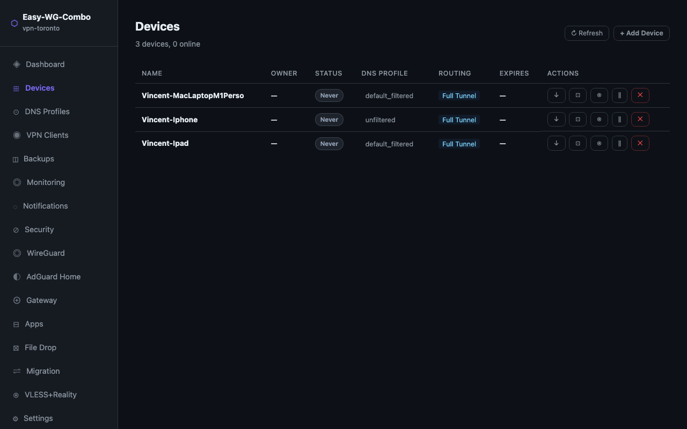
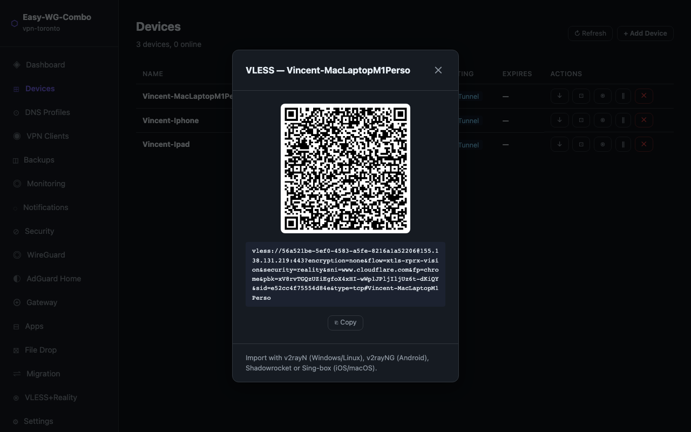
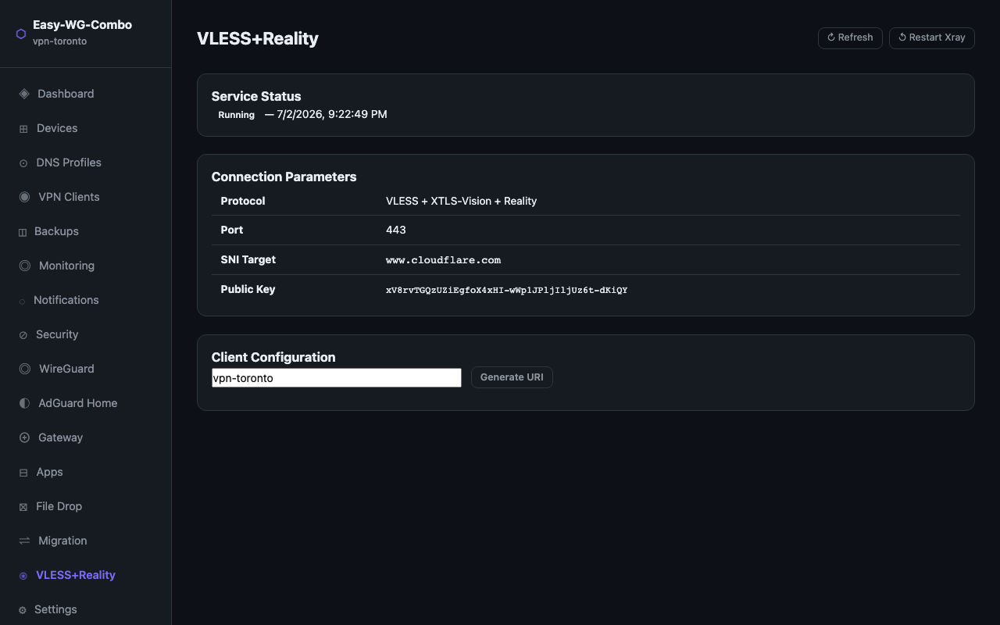

# Xray VLESS+Reality — DPI-resistant tunnel

Easy-WG-Combo can optionally add **Xray VLESS+Reality** alongside WireGuard for use cases where standard VPN protocols are blocked by Deep Packet Inspection (DPI).

VLESS+Reality is designed for high-censorship environments (China GFW-level, Iran, etc.). It borrows the TLS fingerprint from a legitimate public site (e.g. cloudflare.com) — the traffic is indistinguishable from a browser connecting to that site, and active probing returns a genuine response from the borrowed server.

Each device gets its own VLESS UUID. Revoking a device immediately removes its VLESS access alongside WireGuard access.

---

## When to use this

- WireGuard is blocked or throttled by your ISP or country
- You need a tunnel that survives active probing (GFW-style detection)
- You still want the Easy-WG-Combo admin portal and DNS filtering

**Trade-off:** when Xray is active, the admin portal is no longer accessible over public HTTPS. It becomes localhost-only, accessible only via SSH tunnel. This is the safest configuration regardless.

---

## Activation

### 1. Set XRAY_ENABLED in `.env`

```bash
# Edit on the VPS
nano /opt/vps-toronto/.env

# Change:
XRAY_ENABLED=no
# To:
XRAY_ENABLED=yes
```

### 2. Re-run bootstrap.sh

```bash
cd /opt/vps-toronto
./bootstrap.sh
```

When prompted about existing config, choose **keep**. Bootstrap will:
- Pull the Xray Docker image
- Generate a UUID, X25519 key pair, and short ID
- Write private secrets to `.env.secrets`
- Write `./xray/config.json`
- Regenerate the Caddyfile with Caddy on `localhost:8443`
- Start all containers including Xray

### 3. Verify deployment

```bash
./compose.sh ps          # should show 5 containers including xray
./compose.sh logs xray   # should show "Xray started"
```

---

## Accessing the admin portal with Xray active

Caddy is exposed on `CADDY_HTTPS_PORT` (default **8443**) on all interfaces. Access it directly:

```
https://<VPS_IP>:8443
```

The browser will warn about a self-signed certificate — add an exception (Caddy uses its own internal CA). This is expected and safe for a personal admin console.

Login with your admin password as usual.

---

## Screenshots

**Devices tab — ⊛ VLESS button per device**


**VLESS QR modal — scan or copy the URI**


**VLESS+Reality tab — service status and global URI generator**


---

## Generating a client configuration

### Per device — from the Devices tab (recommended)

Each device gets a unique VLESS UUID. To get the QR code for a specific device:

1. Open **Devices** (available in Super User and Advanced mode)
2. Click the **⊛** button on the device row
3. A modal opens with a scannable QR code and a copyable VLESS URI specific to that device
4. Scan with your client app or tap **Copy URI**

Revoking the device from the same table immediately invalidates its VLESS URI.

### Global URI — from the VLESS+Reality tab

A shared fallback URI (using the server-wide UUID) is also available:

1. Open the portal in Super User or Advanced mode
2. Click **VLESS+Reality** in the sidebar
3. Enter a label (e.g. `iPhone-Vincent`) and click **Generate URI**
4. Scan the QR code or copy the URI

> This URI is shared across all devices and cannot be revoked per device. Prefer the per-device method above.

### Via CLI

```bash
./easywg xray client-uri "iPhone-Vincent"
# prints the global VLESS URI with the given label
```

---

## Client apps

| Platform | App | Notes |
|---|---|---|
| Android | v2rayNG | Free, open source |
| iOS / macOS | Sing-box | Free, supports Reality |
| iOS | Shadowrocket | Paid (~$3), very reliable |
| Windows / Linux | v2rayN | Free, open source |
| macOS | Nekobox | Free, open source |

Import the VLESS URI or scan the QR code. No other configuration needed.

---

## Configuration details

| Parameter | Value |
|---|---|
| Protocol | VLESS + XTLS-Vision + Reality |
| Port | 443/TCP |
| Flow | `xtls-rprx-vision` |
| SNI target | `www.cloudflare.com` (default) |
| Fingerprint | `chrome` |

The SNI target can be changed via `XRAY_SNI_TARGET` in `.env`. Any large HTTPS site works — choose one that is not blocked in the target country.

---

## CLI reference

```bash
./easywg xray status              # service status (running/stopped, port, public key)
./easywg xray client-uri [label]  # print VLESS URI for a client
./easywg xray restart             # restart the Xray container
```

---

## Security notes

- `.env.secrets` contains the X25519 private key — treat it like any private key
- Each device has its own VLESS UUID — revoking a device invalidates its UUID in xray/config.json
- The server-wide UUID (`XRAY_UUID`) is a fallback; rotate it by re-running `./bootstrap.sh` (new install)
- Port 443 is fully owned by Xray — nothing else is publicly accessible on that port
- Port 8443 (Caddy) is accessible on all interfaces (direct IP) — restrict by IP in UFW if desired

---

## Disabling Xray

```bash
# In .env on the VPS:
XRAY_ENABLED=no

# Then re-run bootstrap.sh:
./bootstrap.sh
# Choose "keep" for existing config
```

Caddy will move back to port 443, the public HTTPS portal returns, and the Xray container is not started.

---

## Troubleshooting

**Client cannot connect:**
- Check `./compose.sh logs xray` for errors
- Verify port 443/TCP is open: `ufw status`
- Ensure the public key and short ID in the client match what `./easywg xray status` shows

**Portal unreachable after activation:**
- Remember the portal is now at `localhost:8443` — use the SSH tunnel
- Check Caddy is running: `./compose.sh ps`

**Xray container exits immediately:**
- Check `./xray/config.json` is valid JSON
- Run `./compose.sh logs xray` for the error
- The private key format must be base64url (generated by `xray x25519`)
